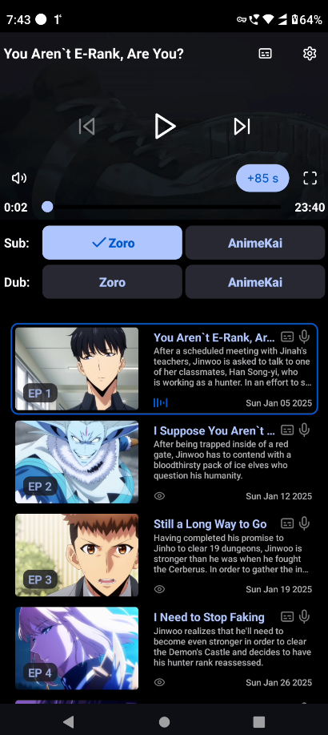

<h1 align="center">
  
  <br />
  Uwumi
</h1>

<p align="center">
  A feature-rich anime, manga and movie streaming app built with React Native and Expo
</p>

## ✨ Features

- 📱 Cross-platform (Android, Android TV) support
- 🎬 Stream anime and movies with multiple quality options
- 📺 Track watch progress across episodes and series
- ⭐ Favorites management for quick access to your preferred content
- 📖 Manga chapter reading functionality
- 🔍 Powerful search with debounced input
- 🌙 Customizable themes with pure black background support
- 🎨 Accent color customization
- 🌐 Multiple server support with dynamic API selection
- 💾 Persistent storage for user preferences

## 📸 Screenshots

| Home & Discovery | Content Details | Video Player | Manga Reader |
|:---------------:|:---------------:|:---------------:|:---------------:|
|  |  |  |  |

| Library & Tracking | Settings & Customization |
|:---------------:|:---------------:|
|  |  |

## 🚀 Getting Started

### Installation

1. Clone the repository
   ```bash
   git clone https://github.com/2004durgesh/uwumi.git
   cd uwumi
   ```

2. Install dependencies
   ```bash
   npm install
   # or
   yarn install
   ```

3. Start the development server
   ```bash
   npx expo start
   ```

### ENV Variables
```bash

# Create a .env file in the root of the project and add the following variables

EXPO_PUBLIC_API_URL= # API URL for production (Consumet API)
EXPO_PUBLIC_API_URL_DEV= # API URL for development

EXPO_PUBLIC_EPISODE_API_URL= # API URL for episodes in production (https://github.com/2004durgesh/episodes)
EXPO_PUBLIC_EPISODE_API_URL_DEV= # API URL for episodes in development

EXPO_TV=1  # Set to 1 to enable Android TV support
EXPO_TMDB_API_KEY=123456789 # TMDB API key for movie and series data
```   

## 🏗️ Building for Production

### Android
```bash
npm run android
```

## 🤝 **Contributing**  

We ❤️ contributions! Whether it's a **bug fix, feature addition, or documentation improvement**, your help makes **Uwumi** even better.  

### 🛠 **How to Contribute**  

1. **Fork** the repository  

2. **Clone your fork**  
   ```bash
   git clone https://github.com/2004durgesh/uwumi.git
   cd uwumi
   ```

3. **Create a new branch**  
   ```bash
      git checkout -b fix/video-player-controls
      ```

   4. **Make your changes**  
      - Follow the existing **code style** and **best practices**.  
      - Ensure your code is **well-tested and functional**.  

   5. **Commit your changes**  
      ```bash
      git commit -m "feat: add manga chapter bookmark functionality"
      ```

   6. **Push to your branch**  
      ```bash
      git push origin fix/video-player-controls
      ```

7. **Open a Pull Request (PR)**  
   - Go to the [**Uwumi repository**](https://github.com/2004durgesh/uwumi).  
   - Click **New Pull Request** and select your branch.  
   - Add a **clear title & description** explaining your changes.  
   - Submit the PR and wait for review! 🚀  

### ✅ **Contribution Guidelines**  

✔️ Keep commit messages **clear and descriptive** (e.g., `fix: Adjust button visibility`).  
✔️ Follow [Conventional Commits](https://www.conventionalcommits.org/) for commit messages.  
✔️ Ensure **no breaking changes** unless necessary.  
✔️ Run tests before submitting a PR (if applicable).  
✔️ If adding a new feature, update the **README** if needed.  

### 🏅 **Need Help?**  

If you have any questions, feel free to:  
💬 **Open an issue** – Report bugs, suggest features, or ask for help.  
🚀 **Your contributions help make Uwumi better!** 🎉 


## Acknowledgements
[Consumet API](https://github.com/consumet/api.consumet.org)